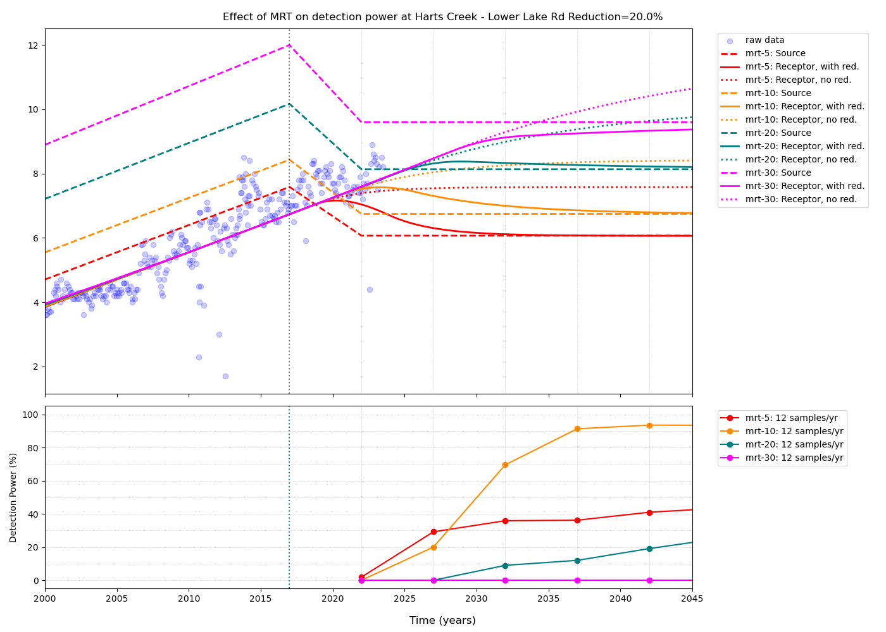
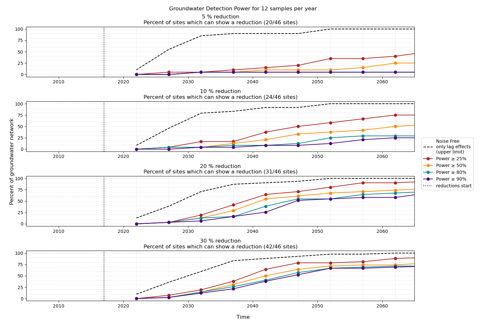
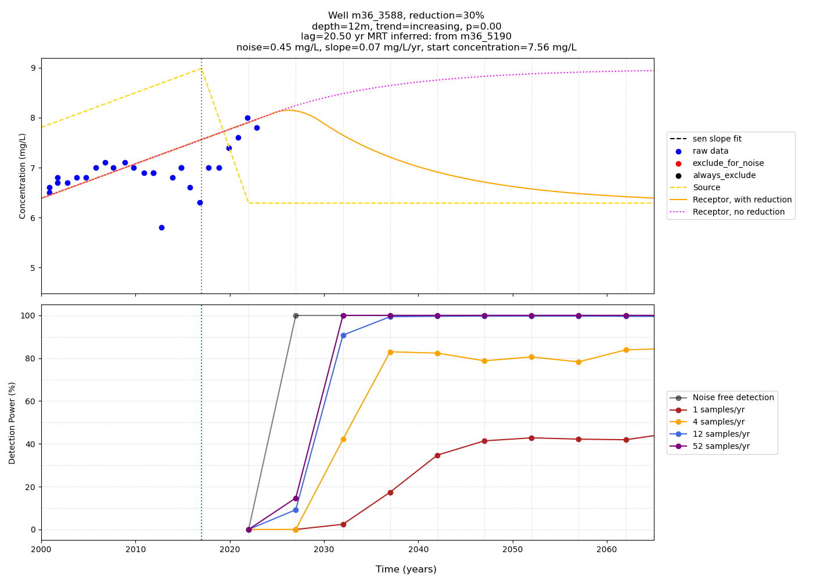
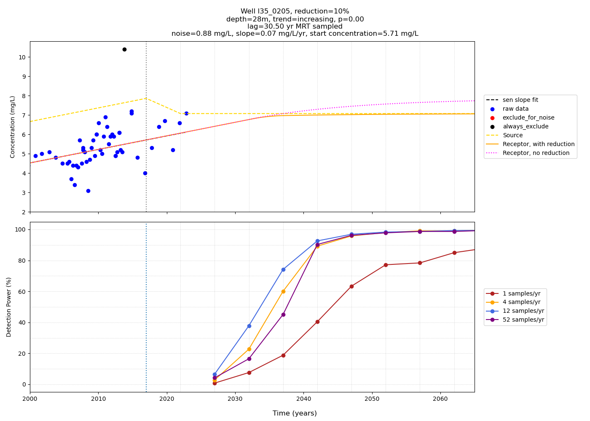
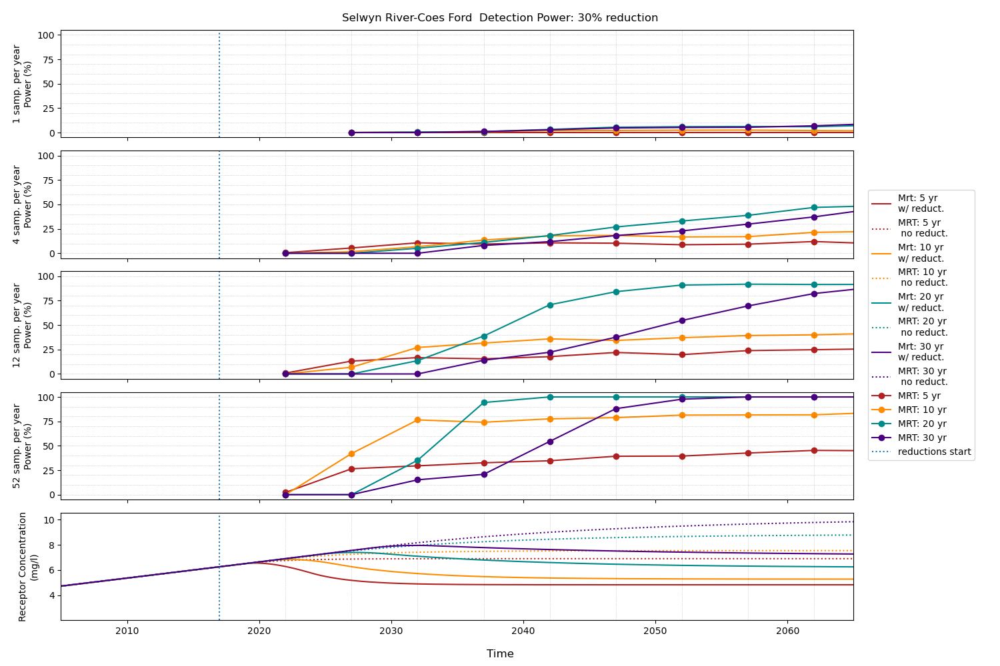

Detection Power Analysis of Plan Change 1 in the Selwyn District, New Zealand
#################################################################################

    Detection Power in Hart's Creek

:Author:  Matt Dumont
:Date:  2023-04-01
:Version:  1.0.0
:Status:  Final
:KSL project: Z22014OLW_SelwynCaseStudy
:Purpose: This document describes the code and results for detection power analysis for the Selwyn District, New Zealand, for the Our land and Water project Monitoring Freshwater Improvements (https://www.monitoringfreshwater.co.nz/). This case study assess the power of Environment Canterbury's existing monitoring network to detect changes in groundwater levels and nitrate concentrations in the Selwyn District following Plan Change 1.
:Versions:
    - 2023-09-01: begin development
    - 2023-12-13: first draft

This project supports a case study of the Selwyn District, New Zealand, for the Our land and Water project Monitoring Freshwater Improvements (https://www.monitoringfreshwater.co.nz/). This case study assess the power of Environment Canterbury's existing monitoring network to detect changes in groundwater levels and nitrate concentrations in the Selwyn District following Plan Change 1.

The final report for this project is available in this repository at:  .. todo

.. contents:: Table of Contents

Terminology / methods overview
================================

For simplicity we have used the following terminology throughout this document and the file names in the repo:

- **no trend**: a site that has no identifiable trend in the historical data (e.g. a Mann-Kendall test does not identify a trend, p>=0.05)
- **trend**: a site that has an identifiable trend in the historical data (e.g. a Mann-Kendall test identifies a trend, p<0.05)
- **plateau**: a site that has an identifiable trend in the historical data and the trend is increasing (e.g. a Mann-Kendall test identifies a trend, p<0.05, and the slope of the trend is positive).  The plateau sites have an MRT such that the concentration will only increase over time, but achieve a steady state of n% less than the "no change" concentration. Where a site is identified as a 'plateau' site, the detection power is where an increasing and no change slope is detected instead of the typical increasing and decreasing slope.  See the final report for more information.
- **no noise**: asssessments of detection power without considering NO3-N noise (e.g. lag processes only)
- **true source concentration**: the true source concentration predicted from the historical observed trend and age distribution.
- **true receptor concentration**: the true receptor concentration predicted from the **true source concentration**, the reductions (*a priori* pathway and the age distribution without the effect of NO3-N noise.
- **true receptor concentration no change**: the true receptor concentration predicted from the **true source concentration** and assuming the **true source concentration** remains constant in the future (no reduction) and the age distribution without the effect of NO3-N noise and no reductions.

*a priori* pathways
--------------------

Through discussions with Environment Canterbury (ECAN) we identified several *a priori* pathways for nitrate concentrations in the Selwyn District. These pathways are:

- Plan change 1 (PC1) reductions are applied linearly starting in 2017 and are fully implemented by 2022
- PC1 reductions were assessed assuming a 5%, 10%, 20%, and 30% reduction in nitrate concentrations
- sampling frequencies of (1, 4, 12, 52) samples per year
- sampling duration of (5, 10, 15, 20, 25, 30, 35, 40, 45, 50) years after the implementation of Plan Change 1

Mean residence time (MRT) methodology
--------------------------------------

Age tracer data is fundamentally important for detection power analysis.  The age tracer data was provided via the Our Land and Water project and included both a mean residence time and a exponential fraction.  From these data using an Exponential Piston Flow Model (EPM) we generated age distributions for each site. Where a groundwater site did not have an age tracer test we estimate the MRT from nearby sites.  The method was somewhat manual and specific.  The method is detailed the figures of each site and in the N metadata file.  For the surface water sites no age tracer data was available.  For these sites we assessed the detection power assuming a MRT of (5, 10, 20, 30) years.  The exponential fraction was was assumed to be the median of the exponential fractions within (7.5 or 10 km) and <=10m depth. Details on whether the exponential fraction was taken from 7.5 or 10 km is available in the N metadata file (column 'age_dist').

Results overview and locations:
===============================

The location of the final sites are shown in the figure below.  The sites are color coded by the type of site (surface water, or groundwater)

.. figure:: figures/selwyn_sites.png
    :scale: 25 %
    :align: left
    :alt: Site locations

    Site locations

The key outputs are:

- Overview plots of the detection power for the full groundwater network where a reduction is possible (excluding plateau sites).  These plots are located in the `overview_plots <GeneratedData/overview_plots>`_ folder.
- detection power plots for each site, reduction; and, for surface water sites, assumed MRT.  These plots are located in the `power_calc_site_plots <GeneratedData/power_calc_site_plots>`_ folder and the `power_calc_plateau_sites <GeneratedData/power_calc_plateau_sites>`_ folder for normal and plateau sites, respectively.
- Comparisons of the detection power of surface water sites assuming different MRTs.  These plots are located in the `power_mrt_comp <GeneratedData/power_mrt_comp>`_ folder.

How to read the results plots
===============================

Overview plots
----------------

An example overview plot is show below. There is an overview plot for each sampling frequency. There are 4 subplots in each overview plot.  The subplots are the likelihood of detecting a 5%, 10%, 20%, and 30% reduction in nitrate concentrations, respectively.  The x-axis is the sampling duration and the y-axis is the percent of those sites which can detect a change (no plateau sites) that have detected  change at a given cutoff level of detecting a change.  The color of each line represents that cutoff level (e.g. power >= 25%). Therefore the correct interpretation of the red point on subplot 4 (30% reduction) at (2037, c. 37) is that 37% of the sites that can detect a 30% reduction (42/46 sites) in nitrate concentrations will have a probability of detecting the change >= 25% in 2037 (after 20 years of monitoring) with monthly sampling.

    Overview plot for the detection power of the full groundwater network assuming 12 samples per year.

Detection power plots
----------------------

An example detection power plot is shown below for site m36_3588 assuming a 30% reduction in nitrate concentrations.  There are two subplots; for both the x-axis is the sampling duration/date. For the top plot the y-axis is NO3-N concentration (mg/l).  The raw sample data and whether or not those data were included in the analysis (blue included, red/black not included), the predicted source concentration (yellow), the predicted receptor concentration with (gold) and without the implemented reduction (fuchsia). In the lower subplot the y-axis depicts the likelihood that a change in nitrate concentrations will be detected.  The color of the line represents the sampling frequency (e.g. monthly, quarterly, etc.).  Note that the grey line is the detection power assuming no noise (e.g. lag only or an "infinite" sampling frequency).  The correct interpretation of this plot is that this well would only be able to theoretically detect a change at or after 2027 (grey line).  With quarterly sampling however the noise of the site is such that the detection power is only likely to exceed 80% in 2037 (gold line).

    Detection power plot for site m36_3588 assuming a 30% reduction in nitrate concentrations.

Plateau site plots
--------------------

The plateau site plots are fundamentally the same; however as is shown below the concentrations will never reduce as the site was not yet at steady state (or even close to it).  Therefore the concentration will simply plateau at a lower concentration. The correct interpretation of this plot is that a change from increasing to no-change in concentration would be detected with a >= 80% probability by 2043 for quarterly or more frequent sampling. Note that because this is a Plateau site the detection power is matching the condition of an increasing concentration (p<0.05) and a no change concentration (p>=0.50) instead of the typical increasing (p<0.05) and decreasing (p<0.05) concentration.  See the final report for more information.

    Detection power plot for site l35_0205 assuming a 10% reduction in nitrate concentrations.

Surface water MRT comparison plots
------------------------------------

An example surface water MRT comparison plot is shown below. The x-axis is the sampling duration (for all subplots). the y-axis for the first 4 subplots is the likelihood of detecting a 30% reduction with annual, quarterly, monthly, and weekly sampling frequencies, respectively. The y-axis is the predicted true receptor concentration with (solid line) and without (dotted line) the implemented reduction.  The color of each line represents the assumed MRT (e.g. 5, 10, 20, 30 years).  The correct interpretation of this plot is that the detection power of this site is highly dependent on the assumed MRT.  For example, with weekly sampling the detection power is only likely to exceed 80% in 2037 with an assumed MRT of 20 years. This is a counter intuitive result as conceivably the detection power should decrease with increasing MRT. What is happening here is that a shorter MRT of 5 or 10 years implements the reduction too quickly to be confidently detected with a multipoint Mann-Kendall approach.  A counter factual approach (see final report) would likely be able to detect the change with a shorter MRT earlier.  However this approach was beyond the scope of this project.  Future planned development for `the groundwater detection calculator <https://github.com/Komanawa-Solutions-Ltd/gw_detect_power>`_ will implement this counterfactual approach.

    Detection power plot for site Selwyn River-Coes Ford assuming a 30% reduction in nitrate concentrations and different MRTs.

Python Environment
==================
This model was developed in Python on linux (ubuntu 20.04).  The Python environment was created using the Anaconda package manager.
The environment was created using the following command: ::

    conda create -c conda-forge --name OLW python=3.11 pandas=2.0.3 numpy=1.25.2 matplotlib=3.7.2 scipy=1.11.2 pytables=3.8.0 psutil=5.9.5 geopandas netcdf4 openpyxl h5py scikit-learn cartopy py7zr

    conda activate OLW
    pip install pyhomogeneity
    pip install git+https://$kslgittoken@github.com/Komanawa-Solutions-Ltd/kslcore.git  # private repo for internal path management
    pip install git+https://github.com/Komanawa-Solutions-Ltd/kendall_multipart_kendall.git
    pip install git+https://github.com/Komanawa-Solutions-Ltd/gw_age_tools
    pip install git+https://github.com/Komanawa-Solutions-Ltd/gw_detect_power

In addition to the creation code above, the repo environment was exported in:

-  `env.yml <environment.yml>`_

However these exports are raw and therefore may be difficult to directly install and may contain proprietary packages (e.g. kslcore) We have left them as they provide an exact copy of the development environment if future users have versioning problems with the above conda installs

Github repo structure
======================

The full data analysis was conducted within this repository. All datasets used to generate the outputs and all outputs are included in the repo.

Comment keyword standards:
---------------------------

We have used a number of keywords (case insensitive) to support identifying important comments within the text. These are:

-  TODO: A comment that identifies a task that needs to be completed
-  FIXME: A comment that identifies a problem that needs to be fixed
-  KEYNOTE: A comment that identifies a key assumption or point of interest
-  OPEN SOURCE IMPROVE: A comment that identifies a potential improvement to existing open source code repos

At this point only KEYNOTE and OPEN SOURCE IMPROVE should remain in the repo, however it is possible that some
TODOs and FIXMEs will remain accidentally. Note that these have been dealt with, but were accidentally not removed from the code.
Many IDEs have a search function that can be used to find these keywords, which we encourage you to use.

Proprietary packages
--------------------
For the most part we relied on open source packages , but we did use some proprietary in
house packages. These packages are not included in this repository. Generally with only minor modification all analysis should be abe to be rerun without these packages. The exception is the BASE analysis. If you are interested in running BASE analysis please contact Matt Dumont (Matt@komanawa.com) to discuss options.

The proprietary packages used in this model are:
    - kslcore
        - an internal package used to ensure consistant access to our computational resources (google drive, NAS, etc.) across multiple machines
    - from solvers.DreamzsBPEFM import DreamzsBpefmSolver
        - an internal package use to run the BASE analysis
    - from run_managers.run_multiprocess import run_multiprocess
        - an internal package used to run the model in parallel
    - from generators.normal_path_change import NormalPath
        - an internal package used to generate the normal path changes

Dead links
----------
We have made a substantial effort to ensure that all links in the model are valid. However, there are likely some links that
return a 404 error.  If you come across this, then please contact the author of this model: Matt@komanawa.com so that
he can fix the links.  Typically the links are relative to the repository.  if the link is broken you can likely infer
the correct location by looking at the link and the repo structure.

Github Repo index
=====================
- `BASE_investigation <BASE_investigation>`_: the BASE investigation trial
    - `run_base.py <BASE_investigation/run_base.py>`_: first trial of BASE non-normal path
    - `run_base_normal_path.py <BASE_investigation/run_base_normal_path.py>`_: second trial of BASE normal path
- `GeneratedData <GeneratedData>`_: all data generated in the project
    - `Noise_free_no_trend_detection_power.hdf <GeneratedData/Noise_free_no_trend_detection_power.hdf>`_: generated detection powers for sites without an identifiable trend in the historical data with the assumption that the data is noise free
    - `Noise_free_trend_detection_power.hdf <GeneratedData/Noise_free_trend_detection_power.hdf>`_: generated detection powers for sites with an identifiable trend in the historical data with the assumption that the data is noise free (only the effect of lag)
    - `all_n_data.hdf <GeneratedData/all_n_data.hdf>`_: all of the individual samples of N
    - `all_n_metadata.hdf <GeneratedData/all_n_metadata.hdf>`_: metadata for all sites
    - `no_trend_detection_power.hdf <GeneratedData/no_trend_detection_power.hdf>`_: generated detection powers for sites without an identifiable trend in the historical data (includes the effect of noise and lag)
    - `overview_plots <GeneratedData/overview_plots>`_: plots depicting the overall ability of the network to detect changes
    - `plateau_detection_power_red10.hdf <GeneratedData/plateau_detection_power_red10.hdf>`_: generated detection powers for sites with a 10 percent reduction and an identifiable trend in the historical data which means that the concentration will only increase (includes the effects of lag and noise).
    - `plateau_detection_power_red20.hdf <GeneratedData/plateau_detection_power_red20.hdf>`_: generated detection powers for sites with a 20 percent reduction and an identifiable trend in the historical data which means that the concentration will only increase (includes the effects of lag and noise).
    - `plateau_detection_power_red30.hdf <GeneratedData/plateau_detection_power_red30.hdf>`_: generated detection powers for sites with a 30 percent reduction and an identifiable trend in the historical data which means that the concentration will only increase (includes the effects of lag and noise).
    - `plateau_detection_power_red5.hdf <GeneratedData/plateau_detection_power_red5.hdf>`_: generated detection powers for sites with a 5 percent reduction and an identifiable trend in the historical data which means that the concentration will only increase (includes the effects of lag and noise).
    - `power_calc_plateau_sites <GeneratedData/power_calc_plateau_sites>`_: Plots for all of the plateau sites
    - `power_calc_site_plots <GeneratedData/power_calc_site_plots>`_: Plots for all of the sites (excluding plateau sites)
    - `power_mrt_comp <GeneratedData/power_mrt_comp>`_: plots comparing the detection power of a given surface water site under different assumed MRTs
    - `trend_detection_power.hdf <GeneratedData/trend_detection_power.hdf>`_: generated detection powers for sites with an identifiable trend in the historical data (includes the effect of noise and lag)
    - `true_receptor_conc_slope_init.hdf <GeneratedData/true_receptor_conc_slope_init.hdf>`_: the true receptor concentrations for the initial conditions and propagated forward in time (e.g. with reductions).
    - `true_receptor_conc_slope_init_no_change.hdf <GeneratedData/true_receptor_conc_slope_init_no_change.hdf>`_: the true receptor concentrations for the initial conditions and propagated forward in time (e.g. with no reductions)
    - `true_source_conc_slope_init.hdf <GeneratedData/true_source_conc_slope_init.hdf>`_: predicted source concentration for the historical data based on the age tracer data and observed receptor concentrations.
- `LICENSE <LICENSE>`_: the license for this repo
- `README.rst <README.rst>`_: this file
- `detection_power <detection_power>`_: the detection power analysis
    - `detection_power_calcs.py <detection_power/detection_power_calcs.py>`_: the main detection power analysis calculations
    - `plot_individual_detection_plots.py <detection_power/plot_individual_detection_plots.py>`_: plots the individual detection power plots
- `env.yml <env.yml>`_: the conda environment used to run the model
- `figures <figures>`_: supplemental figures for writeup
- `generate_true_concentration <generate_true_concentration>`_: generate the "true" source and receptor concentrations
    - `gen_true_slope_init_conc.py <generate_true_concentration/gen_true_slope_init_conc.py>`_: generate the true source and receptor concentrations
- `hearts_creek_fig.py <hearts_creek_fig.py>`_: the hearts creek figure for a hydrosoc presentation
- `inital_data_reivew <inital_data_reivew>`_: an initial review of the data
    - `plot_site_n_data.py <inital_data_reivew/plot_site_n_data.py>`_: plots the n data for each site
- `notes.txt <notes.txt>`_: notes on the project for internal use
- `original_data <original_data>`_: the original data used in the project provided by Environment Canterbury or from OLW
    - `20230926_SWZ_KSL.xlsx <original_data/20230926_SWZ_KSL.xlsx>`_: the original N data provided by Environment Canterbury
    - `Additional_Age_Model_Details_GNS.xlsx <original_data/Additional_Age_Model_Details_GNS.xlsx>`_: Age tracer data provided by Environment Canterbury
    - `Age_Tracer_PowerBI_Selwyn_Waihora_extracted25Sept2023_checked.xlsx <original_data/Age_Tracer_PowerBI_Selwyn_Waihora_extracted25Sept2023_checked.xlsx>`_: Age tracer data provided by Environment Canterbury
    - `GroundwaterSOE_Nitrate_timeseries_Selwyn_Waihora_exported22Sept2023.xlsx <original_data/GroundwaterSOE_Nitrate_timeseries_Selwyn_Waihora_exported22Sept2023.xlsx>`_: N data provided by Environment Canterbury
    - `n_metadata_lisa.csv <original_data/n_metadata_lisa.csv>`_: metadata from this process which was provided to Lisa Scott of Environment Canterbury for review.  This file holds her comments.
    - `olw_data <original_data/olw_data>`_: data from the Our Land and Water project note we used this data to provide the age tracer information as it contained the same or additional information to the provided ECAN data.
- `project_base.py <project_base.py>`_: the base file path management for the project
- `python_env.txt <python_env.txt>`_: working notes on the python environment
- `site_selection <site_selection>`_: the site selection and data ingestion process
    - `age_tracer_data.py <site_selection/age_tracer_data.py>`_: processes the age tracer data
    - `get_n_data.py <site_selection/get_n_data.py>`_: process the n data and flag outliers

